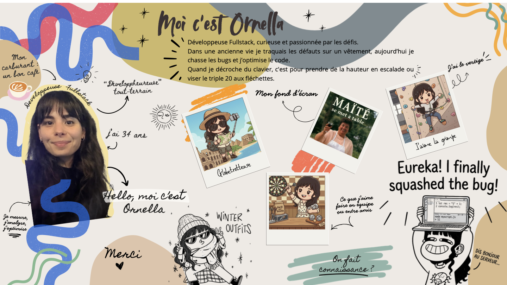

  

  

# 👉 ABOUT ME :

- 👋 Hi, I’m @OrnellaBorges
- 💼 Fullstack Developer (React / Node.js / TypeScript)
- 🛠️ I currently work in TMA / RUN for EmeriaTech on ERP Millenium
- 🚀 I’m open to new opportunities

🇫🇷 Développeuse fullstack après une première carrière en modélisation 2D/3D. J’ai évolué sur des environnements e-commerce, SaaS et ERP (Sarenza, Décathlon/Alltricks, GEO4X). Depuis avril 2026, j’interviens sur le projet ERP Millenium pour EmeriaTech : maintenance corrective et évolutive, stabilisation, support et amélioration continue sur une architecture microservices en monorepo.

🇬🇧 Fullstack developer after an initial career in 2D/3D modeling. I have worked in e-commerce, SaaS, and ERP environments (Sarenza, Decathlon/Alltricks, GEO4X). Since April 2026, I have been working on EmeriaTech’s Millenium ERP project: corrective and evolutionary maintenance, production stability, support, and continuous improvements in a microservices monorepo architecture.

# 👉 SKILLS :

## HARD SKILLS

  
  
  
  
  
  
  
  
  
  
  
  
  
  
  
  
  
  
  
  
  
  
  
  
  
  
  
  
  

## SOFT SKILLS

  
  
  
  
  

# 💻 Projects already done

 👉 Internal project (TMA/RUN)
 
 👉 SaaS & website development
 
 👉 Marketplace evolution
 
 👉 Next.js + Strapi editorial platform
 
 👉 Frontend features and revamps

# 📫 How to reach me?

You can contact me at `borges.ornella@gmail.com`, on [my GitHub](https://github.com/OrnellaBorges) or visit my portfolio : [Ornella Borges](https://obgs-starwars.vercel.app/)
